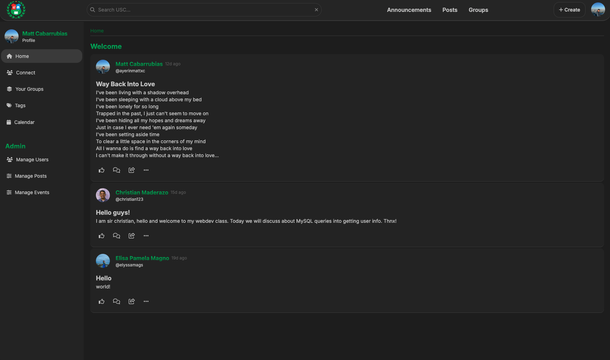
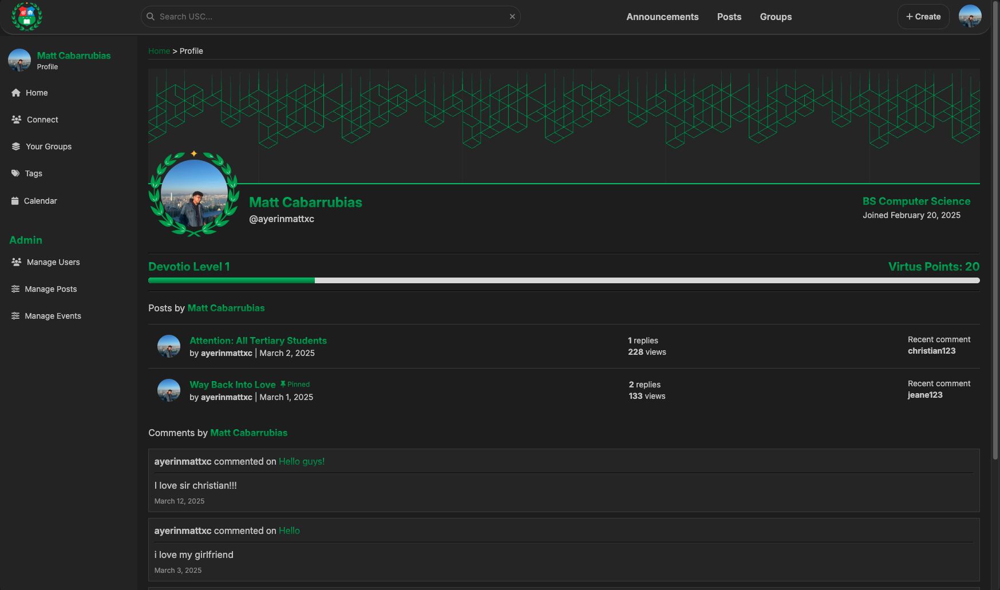

# Schola - School Forum App

[](LICENSE)

Schola is a forum application designed for schools, providing a platform for students, teachers, and staff to interact, share information, and participate in discussions. It features forum interactions, user profiles, a leveling system, and more.

## Features

* **Forum Interactions:** Create and participate in discussions, threads, and posts.
* **User Profiles:** Customizable user profiles with information and activity tracking.
* **Leveling System:** Reward active users with a leveling system based on their participation.
* **[MORE FEATURES PLANNED]**

## Screenshots




## Prerequisites

Before running Schola, ensure you have the following installed:

* **PHP:** Version 7.4 or higher.
* **MySQL:** Version 5.7 or higher (or MariaDB equivalent).
* **Web Server:** (e.g., Apache, Nginx)

## Cloning

1.  **Clone the repository:**

    ```bash
    git clone [https://github.com/devliqht/schola.git](https://www.google.com/search?q=https://github.com/devliqht/schola.git)
    cd schola
    ```

## MySQL Database
The MySQL Database structure is currently not included in this GitHub repo.

## Contributing
This repo is not for contributing and is for syncing purposes only for my web server at dcism.org, but you are still free to look :))

## License
This project is licensed under the MIT License - see the [LICENSE](LICENSE) file for details.

## Author
* [devliqht](https://github.com/devliqht)

## Acknowledgments
Sir Christian Maderazo
