# Schola - School Forum App

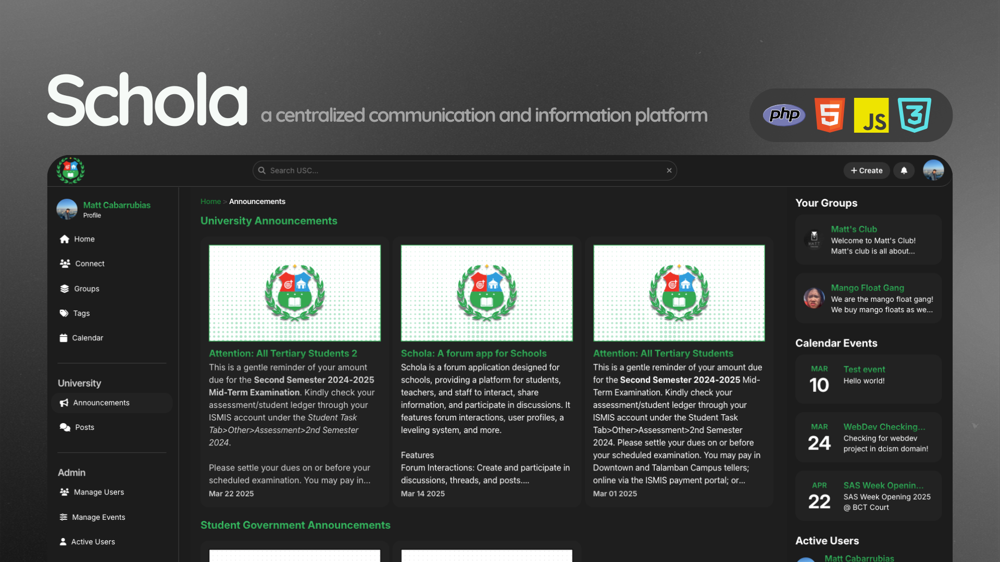

Schola is a forum application designed for schools, providing a platform for students, teachers, and staff to interact, share information, and participate in discussions. It features forum interactions, user profiles, a leveling system, and more.

This is a passion school project, but I hope to implement something like this later in the future but with a more modern approach and with modern technologies.

## Features

* **Forum Interactions:** Create and participate in discussions, threads, and posts, special sections dedicated to the University/School
* **User Profiles:** Customizable user profiles with information and activity tracking
* **Leveling System:** Reward active users with a leveling system based on their participation
* **Post Content Formatting**: Post content formatting powered by tinyMCE
* **Community Groups**: Community groups for common interests
* **Lightmode, responsive layout**: Uses variable coloring and responsive web design practices.

## Screenshots

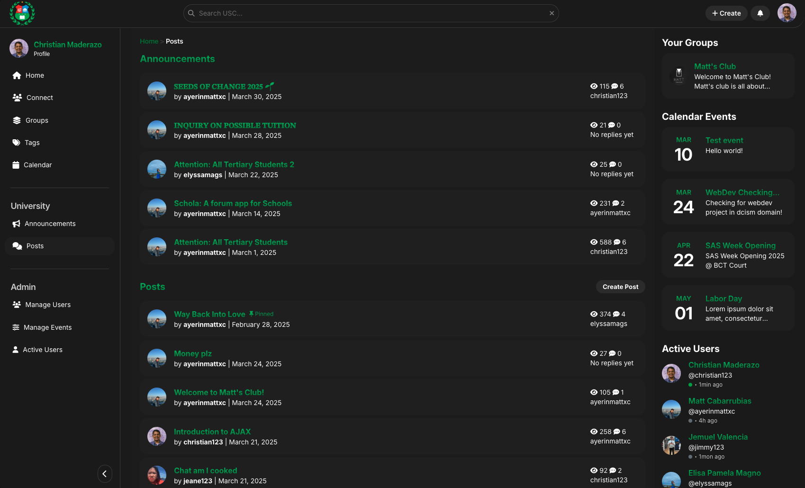
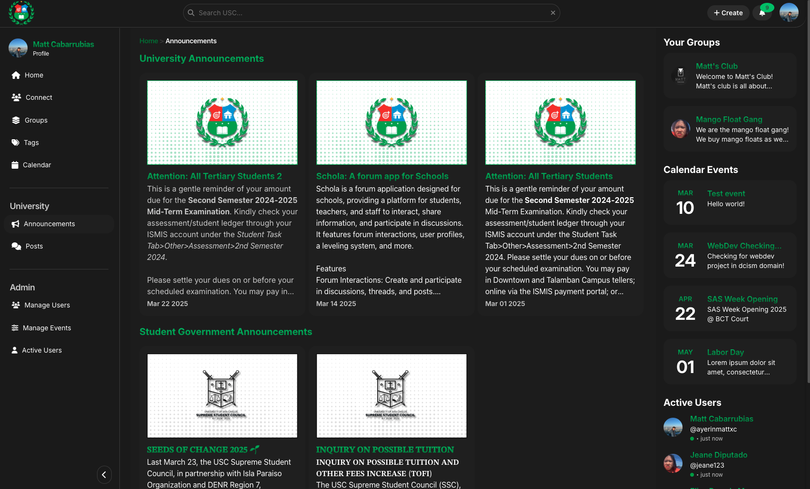
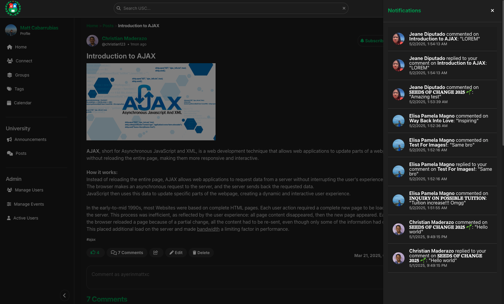
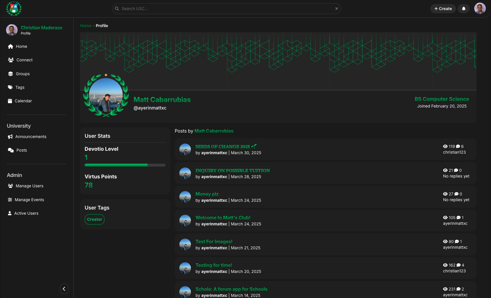
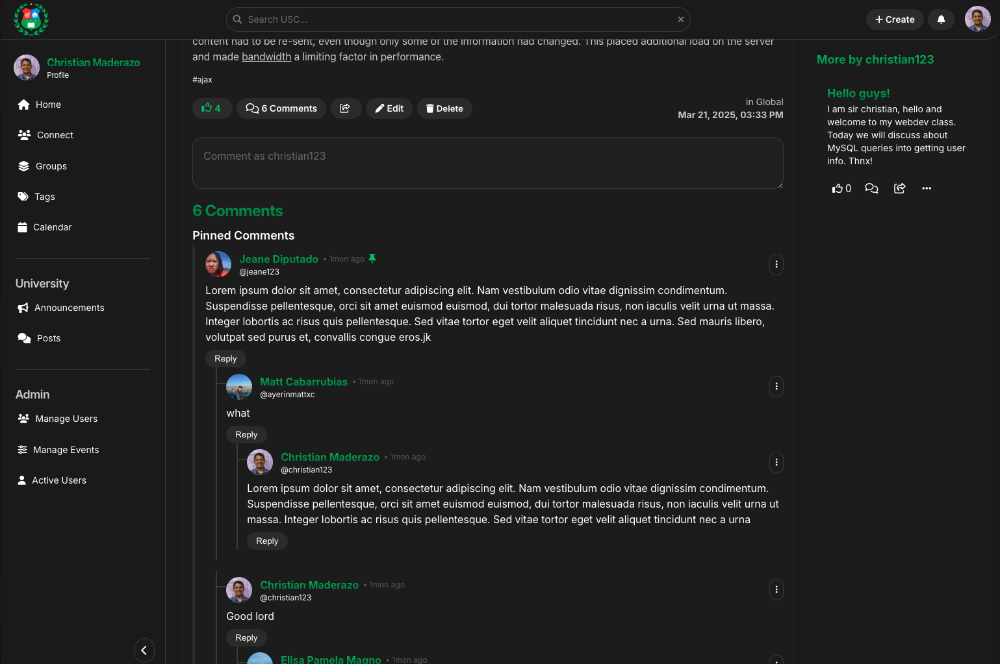
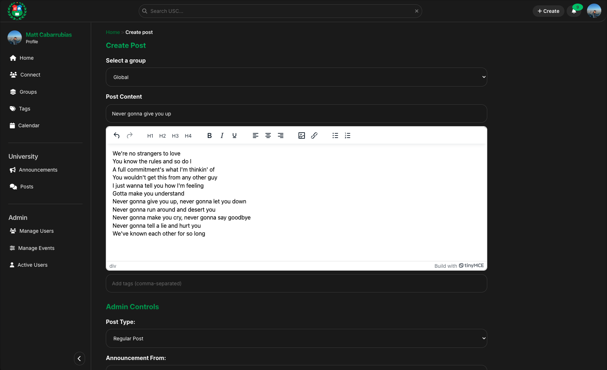
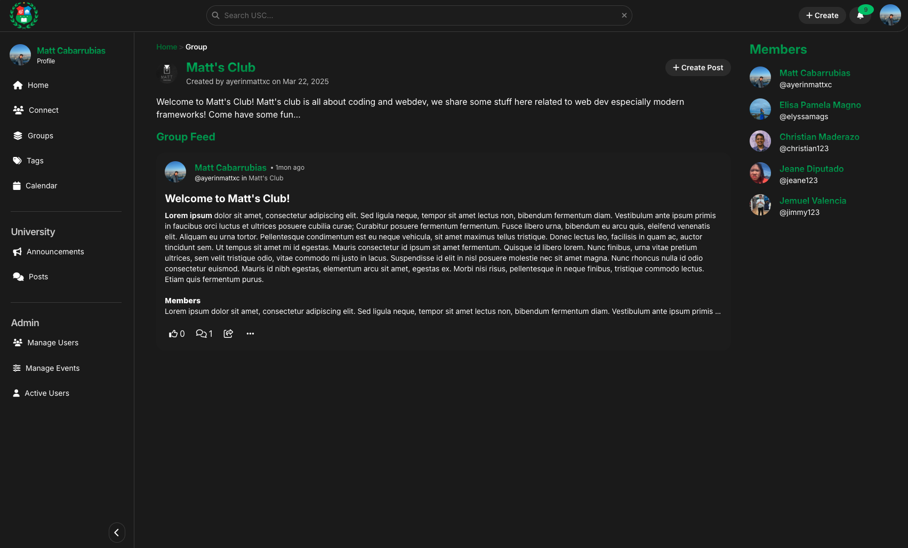
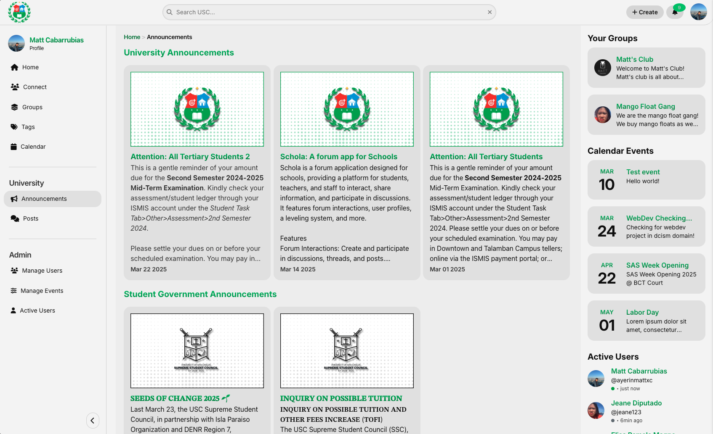
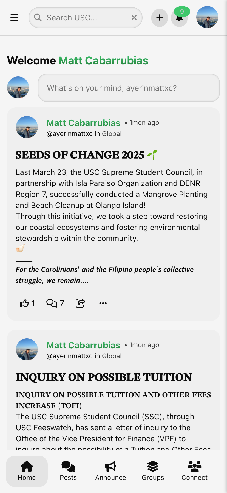
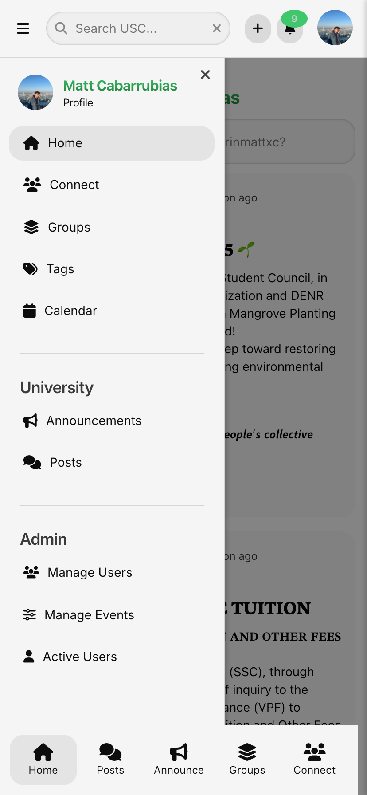
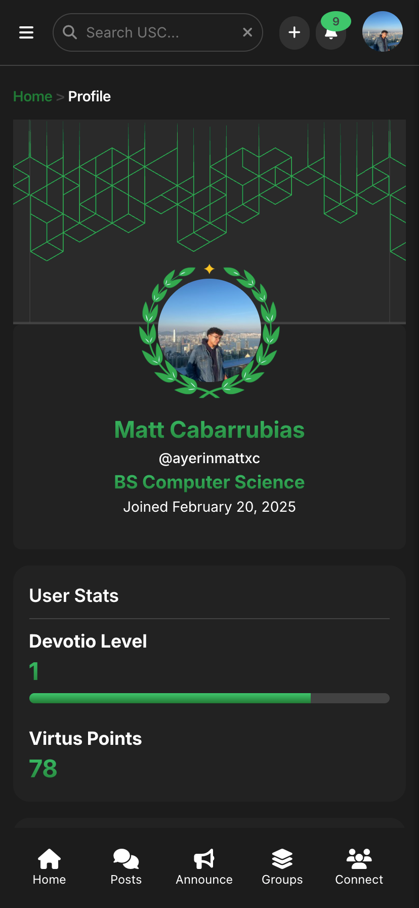

## MySQL Database
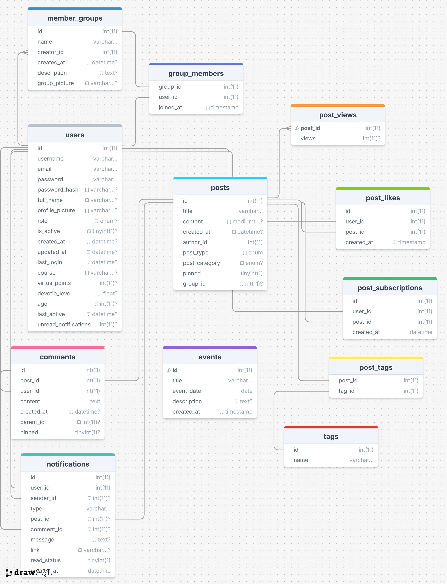

## Contributing
This repo is not for contributing and is for syncing purposes only for my web server at dcism.org, but you are still free to look :))

## License
This project is licensed under the Creative Commons Attribution-NonCommercial 4.0 International License (**CC BY-NC 4.0**) - see the [LICENSE](LICENSE) file for details.

## Author
* [devliqht](https://github.com/devliqht)

## Acknowledgments
- Sir Christian Maderazo
- Fr. Peter Fillo
